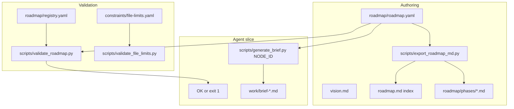

# Architecture (specy-road)

End-to-end flow for this repository:

| Layer | Role |
|-------|------|
| `constitution/` | Purpose and principles (human norms, not machine-enforced) |
| `constraints/` | Machine-readable limits; `file-limits.yaml` enforced by `validate_file_limits.py` |
| `roadmap/` | Canonical `roadmap.yaml` + `registry.yaml` |
| `schemas/` | JSON Schema for roadmap and registry |
| `shared/` | Contracts cited from tasks |
| `scripts/` | Validators, brief helper, markdown export |
| `specy_road/` | Package + `specy-road` CLI entrypoint |

**Source of truth:** [`roadmap/roadmap.yaml`](../roadmap/roadmap.yaml). Markdown views are generated; see [`roadmap-authoring.md`](roadmap-authoring.md).
