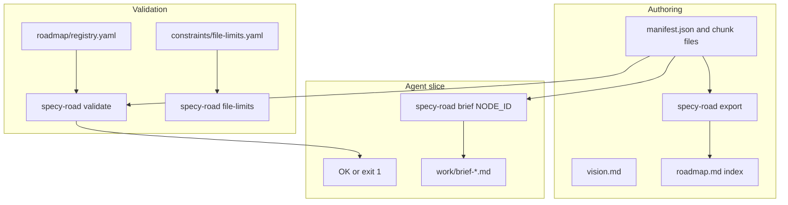

# Architecture (specy-road)

## Scope and non-goals

This repository provides **roadmap-first coordination** (merged graph from `roadmap/manifest.json` + JSON chunk files, validation, briefs, registry) and separates **constitution / principles / constraints / shared contracts**. It does **not** mandate a particular coding agent, IDE, or in-session implementation workflow—see [`philosophy-and-scope.md`](philosophy-and-scope.md).

End-to-end flow in a **consumer project** (after `specy-road init project`):

| Layer | Role |
|-------|------|
| `constitution/` | Purpose and principles (human norms, not machine-enforced) |
| `constraints/` | Machine-readable limits; `file-limits.yaml` enforced by `specy-road file-limits` |
| `roadmap/` | `manifest.json`, JSON chunk files (e.g. `phases/*.json`), `registry.yaml` |
| `schemas/` | JSON Schema for roadmap and registry |
| `shared/` | Contracts cited from tasks |
| `specy_road/` (install) | Python package; `specy-road` CLI; `bundled_scripts/` implements validate/brief/export |

**This toolkit repository** does not use a top-level `schemas/` folder: canonical schema sources are under [`specy_road/templates/project/schemas/`](../specy_road/templates/project/schemas/) (consumer scaffold) and [`tests/fixtures/specy_road_dogfood/schemas/`](../tests/fixtures/specy_road_dogfood/schemas/) (dogfood for CI).

**Source of truth:** node definitions in chunk files under `roadmap/` (see [`roadmap-authoring.md`](roadmap-authoring.md)). `roadmap.md` at the **project** root is a generated index.

**This repository** additionally keeps a dogfood test fixture under [`tests/fixtures/specy_road_dogfood/`](../tests/fixtures/specy_road_dogfood/) for CI (`--repo-root tests/fixtures/specy_road_dogfood`). It is sample data for exercising the toolkit, not the toolkit's canonical product roadmap.
