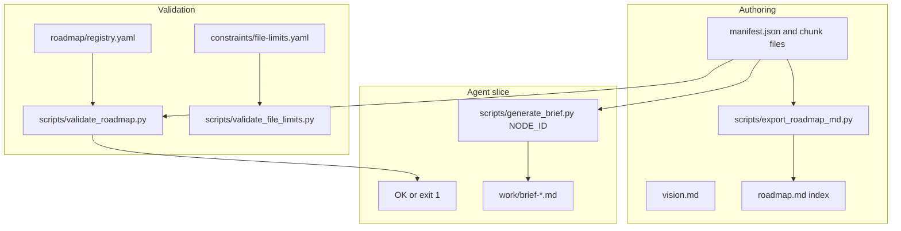

# Architecture (specy-road)

## Scope and non-goals

This repository provides **roadmap-first coordination** (merged graph from `roadmap/manifest.json` + JSON chunk files, validation, briefs, registry) and separates **constitution / principles / constraints / shared contracts**. It does **not** mandate a particular coding agent, IDE, or in-session implementation workflow—see [`philosophy-and-scope.md`](philosophy-and-scope.md).

End-to-end flow for this repository:

| Layer | Role |
|-------|------|
| `constitution/` | Purpose and principles (human norms, not machine-enforced) |
| `constraints/` | Machine-readable limits; `file-limits.yaml` enforced by `validate_file_limits.py` |
| `roadmap/` | `manifest.json`, JSON chunk files (e.g. `phases/*.json`), `registry.yaml` |
| `schemas/` | JSON Schema for roadmap and registry |
| `shared/` | Contracts cited from tasks |
| `scripts/` | Validators, brief helper, markdown export |
| `specy_road/` | Package + `specy-road` CLI entrypoint |

**Source of truth:** node definitions in chunk files under [`roadmap/`](../roadmap/) (see [`roadmap-authoring.md`](roadmap-authoring.md)). Root [`roadmap.md`](../roadmap.md) is a generated index.
