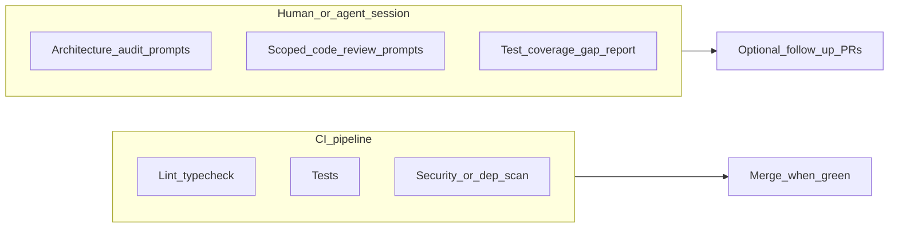

# Dev workflow: executing roadmap items

This document is for the developer (or coding agent) who picks up `Agentic-led` work,
implements it against contracts, and merges back.

For end-user install + everyday usage see [install-and-usage.md](install-and-usage.md). For toolkit-contributor topics (pre-commit hook, IDE stubs, branching/tagging/release) see [contributor-guide.md](contributor-guide.md).
For the PM authoring guide see [pm-workflow.md](pm-workflow.md).

Canonical model: **execute leaves, contextualize with ancestors, roll up progress upward**.

`do-next-available-task` considers **effective** dependencies (each leaf’s explicit `dependencies` plus prerequisites listed on **ancestors**), matching the PM Gantt. A **`type: gate`** node is never a pickup target; PMs clear a scoped hold by marking that Gate **Complete** (see [roadmap-authoring.md](roadmap-authoring.md#gate-type-gate)).

## Quick reference

```bash
# Terminal
# Auto-picks first actionable leaf (outline order after Blocked / MR-rejected priority)
specy-road do-next-available-task   # sync, brief, register leaf claim on base, push base, branch, prompt
specy-road abort-task-pickup        # undo pickup: deregister on base, push base, delete local feature/rm-*, clean work/

specy-road mark-implementation-reviewed  # human gate: after work/implementation-summary-<NODE_ID>.md
specy-road finish-this-task         # complete, validate, export, commit, PR hint (--push optional)
specy-road validate                 # validate merged roadmap graph + registry
specy-road brief <NODE_ID>          # manual: generate brief for a specific node
specy-road export                   # regenerate roadmap.md

#Optional:
specy-road do-next-available-task --interactive   # choose task by number (same git steps)
specy-road do-next-available-task --no-ci-skip-in-message   # registration commit without CI-skip tokens
specy-road abort-task-pickup --force   # abandon pickup when the feature branch has local-only commits (destructive)

# Milestone rollup (one PR to integration after many leaves under a parent):
specy-road start-milestone-session <PARENT_NODE_ID>   # requires parent `codename`; ensures feature/rm-<parent-codename>
specy-road do-next-available-task --milestone-subtree # or: --under <PARENT_NODE_ID>
specy-road finish-this-task          # with session: lands bookkeeping on integration, merges leaf into rollup branch
specy-road open-milestone-pr         # print gh/glab one-liner (rollup head → integration base)

```


```text
# IDE slash commands (after specyrd init --role dev)
/specyrd-do-next-task   — automated start
/specyrd-abort-task-pickup — undo automated start (deregister, return to integration branch)
/specyrd-claim          — manual start: register on integration, then branch (see below)
/specyrd-brief          — manual start: generate brief
/specyrd-mark-reviewed  — mark implementation reviewed (when gate enabled)
/specyrd-finish         — finish (both paths)
/specyrd-validate       — validate at any point
```

## Agents and registration

**Always:** Run **`specy-road do-next-available-task`** from the repo root. The command **syncs** the integration branch (`git fetch`, checkout, `merge --ff-only`), **commits** `roadmap/registry.yaml` there, **pushes** it to the remote, then creates **`feature/rm-<codename>`** — so teammates and the PM Gantt see the claim after `git pull` / fetch on that branch. There is **no** `--no-sync` or `--no-push-registry`; if push fails, fix auth/network and retry so the claim reaches **`remote/<integration-branch>`**.

See **`specy-road do-next-available-task --help`** and the IDE stub from **`specyrd init`** (e.g. **`/specyrd-do-next-task`**).

---

## Your role in the system

| You own | You do not touch |
| --- | --- |
| Branch, implementation, tests, merge | Roadmap chunk authoring (PM territory) |
| Registry claim + deregistration | Human-led gate decisions |
| Pre-commit validation passing | `shared/` contracts (read only — flag gaps to PM) |

If you reach an `agentic` task whose `agentic_checklist` is incomplete or whose
`contract_citation` does not resolve to a real file — **stop**. Flag it to the PM.
A missing contract is a planning gap, not something to fill during implementation.

---

## The task loop

### Start: automated path (`do-next-available-task`)

The CLI keeps the **integration branch** current (from **`roadmap/git-workflow.yaml`**, overridable with **`--base`** / **`--remote`**), then:

1. Selects the **first actionable leaf** only: priority (**Blocked**, then **Git-rejected MR** when enrichment is available), then among the rest **outline (tree) order** — pre-order walk with siblings sorted by `(sibling_order, id)` — not raw merged JSON chunk order. Parent/umbrella nodes are context containers and cannot be directly claimed by default pickup. Pass **`--interactive`** to choose by number (or leaf id) from the same ordered leaf list — **both modes run the same steps after selection**. See [roadmap-authoring.md](roadmap-authoring.md#reordering-and-reparenting).
2. Writes **`work/brief-<NODE_ID>.md`** while still on the integration branch.
3. **Commits `roadmap/registry.yaml` on the integration branch** (registration only — no implementation in that commit). By default the commit message appends common **CI skip** markers (`[skip ci]`, `[ci skip]`, `***NO_CI***`) so full pipelines that honor commit-message skips often stay quiet for this administrative change. Use **`--no-ci-skip-in-message`** when your org policy forbids skip tokens and requires a plain registration commit message. Commit-message skips are **best-effort**: workflows driven only by **path filters** may still run unless your CI also ignores `roadmap/registry.yaml` or similar.
4. **`git push <remote> <integration-branch>`** runs so PMs and the PM Gantt see the claim after `git pull` / fetch. If push fails, resolve the error and retry (or push manually: `git push <remote> <integration-branch>`).
5. Creates **`feature/rm-<codename>`** and writes **`work/prompt-<NODE_ID>.md`** (governance, ancestor planning paths, task sheet excerpt, checklist).

Your working tree must be **clean**. The tool runs `git fetch`, checks out the integration branch, and `git merge --ff-only` to the remote tracking branch. If your local integration branch has diverged, resolve that before retrying. Set **`roadmap/git-workflow.yaml`** to your trunk (e.g. `dev`) or pass **`--base dev`**.

Optional **`roadmap/git-workflow.yaml`** field **`merge_request_requires_manual_approval`** reminds the CLI that MRs need human approval; align with your team’s process before merging.

**Terminal:**

```bash
specy-road do-next-available-task
# optional: specy-road do-next-available-task --base dev --remote origin --interactive
```

**IDE slash command** (after `specyrd init --ai <ide> --role dev`):

```text
/specyrd-do-next-task
```

Open the generated `work/prompt-<NODE_ID>.md` in your agent. Plan, implement, commit incrementally.

### Milestone-scoped execution (rollup branch)

Use this when you want **one integration PR** for **all leaf work under a parent milestone** (e.g. `M7`), instead of opening a PR per leaf.

1. **Parent must have a `codename`** in the roadmap JSON (kebab-case, same pattern as leaf codenames). Phases/milestones without a codename cannot start a rollup session until the PM sets one.
2. **`specy-road start-milestone-session <PARENT_NODE_ID>`** — syncs the integration branch, creates or fast-forwards **`feature/rm-<parent-codename>`** from the remote integration tip, and writes **`work/.milestone-session.yaml`** (parent id, rollup branch, integration branch, remote).
3. **Pick work** — from a clean tree on the integration branch:
   - **`specy-road do-next-available-task --milestone-subtree`** (uses the session file), or
   - **`specy-road do-next-available-task --under <PARENT_NODE_ID>`** (one-shot filter; must match the session file if one exists).
   Claims still **register and push on the integration branch** as usual.
4. **Finish each leaf** — on **`feature/rm-<leaf-codename>`**, run **`specy-road finish-this-task`** as usual. When the session file is present and the leaf is **under** the session parent, the tool:
   - pushes the leaf branch;
   - **cherry-picks** the bookkeeping commit onto the integration branch (so `registry.yaml` and roadmap status stay visible on **`remote/<integration-branch>`** without merging implementation files there);
   - **merges** the full leaf branch into **`feature/rm-<parent-codename>`** and pushes the rollup branch.
   Normal **`on_complete`** (`pr` / `merge` / `auto`) is **not** used for that leaf when this path runs. Use **`specy-road finish-this-task --no-milestone-rollup`** to force the standard finish behavior instead.
5. **Final PR** — when the subtree is done, open **one** PR/MR: **base** = integration branch, **head** = **`feature/rm-<parent-codename>`**. **`specy-road open-milestone-pr`** prints a ready-made `gh pr create` line (and notes for GitLab).

Do **not** rely on editing the parent milestone’s JSON `status` to “Complete” until the subtree is actually done; the PM Gantt already derives **In Progress** from children. Optional: set the parent to **Complete** once all descendant leaves are **Complete** (same as any other manual status edit).

### Abort pickup (`abort-task-pickup`)

If you picked up a task with **`do-next-available-task`** and decide **not** to implement it, run **`specy-road abort-task-pickup`** from the repo root while checked out on **`feature/rm-<codename>`** with a **clean** working tree.

The command **`git fetch`**es, verifies your branch matches **`roadmap/registry.yaml`**, refuses if your feature branch has **commits not on the remote integration branch** (unless **`--force`**), then **`git checkout`** the integration branch, **`git merge --ff-only`** to **`remote/<integration-branch>`**, removes your registry row, **commits** that change on the integration branch, and **`git push`** — so the team sees the claim released the same way pickup published it. It deletes the local **`feature/rm-<codename>`** branch and removes **`work/brief-<NODE_ID>.md`**, **`work/prompt-<NODE_ID>.md`**, and **`work/.on-complete-<NODE_ID>.yaml`**. With **`--force`**, it also deletes **`work/implementation-summary-<NODE_ID>.md`** if present.

If the registry row is already gone after syncing (someone else cleaned up), the command exits with an error; fix **`roadmap/registry.yaml`** or remove the local branch and work files manually.

**Terminal:**

```bash
specy-road abort-task-pickup
# optional: specy-road abort-task-pickup --base dev --remote origin --force
```

**IDE slash command** (after `specyrd init --ai <ide> --role dev`):

```text
/specyrd-abort-task-pickup
```

### Start: manual path

Use the manual path when you pick a specific node without the automated queue, or when automation is unavailable.

1. Find an **actionable leaf** in `roadmap.md` where `execution_milestone` is `Agentic-led` or `Mixed`, `status` is eligible, and dependencies are met.
2. Confirm it is not claimed in `roadmap/registry.yaml`.
3. On the **integration branch** (up to date, clean tree), add the registry row and commit **there first** (same fields as automation: codename, `node_id`, `branch: feature/rm-<codename>`, non-empty `touch_zones`, optional `started`), then create the feature branch:

**Terminal / IDE (`/specyrd-claim`):**

```bash
git checkout <integration-branch>   # e.g. dev
git pull
# edit roadmap/registry.yaml — add entry with branch: feature/rm-<codename>
specy-road validate
git add roadmap/registry.yaml
git commit -m "chore(rm-<codename>): register as in-progress [skip ci] [ci skip] ***NO_CI***"
git push <remote> <integration-branch>   # so PMs see the claim
git checkout -b feature/rm-<codename>
```

4. Generate a brief if needed:

```bash
specy-road brief <NODE_ID> -o work/brief-<NODE_ID>.md
```

5. Implement, commit incrementally.

The PM Gantt can still **merge registry rows from remote `feature/rm-*` refs** when remote overlay is enabled ([design-notes/registry-hydration-remote-refs.md](design-notes/registry-hydration-remote-refs.md)); the **primary** visibility path for new work is the **committed file on the integration branch** after you push.

### Finish (both paths)

Run from the feature branch when implementation is complete.

If **`roadmap/git-workflow.yaml`** sets **`require_implementation_review_before_finish: true`** (default in new `specy-road init project` scaffolds), use this order:

1. **Write** `work/implementation-summary-<NODE_ID>.md` (Summary, Changes, Verification, optional **## Walkthrough**). Use `work/implementation-summary.template.md` as a starting point.
2. **Review** — the developer runs **`specy-road mark-implementation-reviewed`** on the feature branch. It prints the summary, offers an interactive menu (walkthrough / approve / quit), commits **`implementation_review: approved`** in `roadmap/registry.yaml`, then you run **`specy-road finish-this-task`**. Non-interactive approval: `specy-road mark-implementation-reviewed --yes`. Emergency without a summary file: `--allow-missing-summary` (loud warning).
3. **Close the task** — same as below.

If that flag is **false** or omitted, skip step 2 and run `finish-this-task` when work is done (registry rows omit `implementation_review`).

**Terminal:**

```bash
specy-road mark-implementation-reviewed
# optional: specy-road mark-implementation-reviewed --yes
#          specy-road mark-implementation-reviewed --allow-missing-summary   # emergency only

specy-road finish-this-task
# optional: specy-road finish-this-task --push
#          specy-road finish-this-task --push --remote origin
#          specy-road finish-this-task --no-cleanup-work   # keep work/brief-, prompt-, implementation-summary-
```

**IDE slash commands:**

```text
/specyrd-mark-reviewed
/specyrd-finish
```

`finish-this-task` will:

1. Read the current branch name to find the codename and registry entry (the registry `branch` must match `HEAD`). If the implementation-review gate is on, the registry must already show **`implementation_review: approved`** (see `mark-implementation-reviewed` above).
2. Resolve **`on_complete`** (`pr`, `merge`, or `auto`): CLI **`--on-complete`** wins, then **`work/.on-complete-<NODE_ID>.yaml`** from **`do-next-available-task`**, then **`SPECY_ROAD_ON_COMPLETE`**, then **`roadmap/git-workflow.yaml`**, else **`pr`**. See [git-workflow.md](git-workflow.md) (PR and MR are the same idea on different forges).
3. Update the node `status` to `Complete` in the roadmap chunk file.
4. Remove the registry entry.
5. Run `specy-road validate` and `specy-road export`.
6. Unless **`--no-cleanup-work`** is passed or **`cleanup_work_artifacts_on_finish`** is **`false`** in `roadmap/git-workflow.yaml`, remove **`work/brief-<NODE_ID>.md`**, **`work/prompt-<NODE_ID>.md`**, and **`work/implementation-summary-<NODE_ID>.md`** if they exist (stage deletions when those paths are tracked).
7. Commit the bookkeeping changes on the feature branch.
8. If **`--push`** was passed, push the feature branch.
9. If **`on_complete`** is **`pr`**, print `git push` (if needed) and **`gh pr create`**-style guidance for a **PR/MR** to the integration branch. If **`merge`** or **`auto`**, merge the feature branch into the integration branch locally and push the integration branch, or exit with **merge pending** and PR/MR hints on failure (**`auto`** falls back to those hints).

Merge when CI is green and your team’s MR policy is satisfied (or after a successful local integration merge when your workflow uses **`merge`** / **`auto`**).

---

## Branch model

One branch per roadmap **leaf execution target**. Feature branches are created **after** registering on the integration branch; they merge back through a PR/MR to that same integration branch.

```text
main ─────────────────────────────────────────────► main
  └─ feature/rm-auth-middleware ─────────────────┘
  └─ feature/rm-entry-api  ───────────────────┘
  └─ feature/rm-export-pipeline  ─────────────────────┘
```

Multiple parallel branches is the normal operating state. The registry makes active
claims visible so touch zone conflicts surface before file collisions.

**Naming:** `feature/rm-<codename>` where `<codename>` matches the roadmap node's
`codename` field exactly (kebab-case). The `rm-` prefix distinguishes roadmap-driven
branches from ad-hoc `fix/<slug>` or `feature/<slug>` branches.

Non-roadmap work (hotfixes, tooling) uses `fix/<slug>` without the `rm-` prefix and
does not touch `registry.yaml`.

---

## After merge: fix, refactor, or hardening

Merged work can still need correction (bugs), standards cleanup, or a maintainer-led
refactor. That is normal; it does not require rewriting history on a shared integration
branch.

**Non-roadmap cleanup (default):** Branch from current `main` (or your team’s integration
branch), use `fix/<slug>` or `feature/<slug>`. Do **not** add a `registry.yaml` entry
unless your team explicitly tracks this work on the roadmap.

**Roadmap-visible rework:** If stakeholders need the graph to show the effort (touch
zones, dependencies, ordering), the PM adds a **new** node (or follows your team’s
policy for reopening — see below). You then use `feature/rm-<codename>` with
registration on the integration branch per [git-workflow.md](git-workflow.md).

Git mechanics for “undoing” a merge on a shared branch are covered in
[git-workflow.md](git-workflow.md#correcting-merged-work-revert-vs-follow-up) (revert PR
vs follow-up branch — avoid `git reset --force` on shared history).

---

## Re-doing or re-opening a roadmap item

**Registry:** A `feature/rm-<codename>` branch is **one active claim per codename**.
After `finish-this-task` and merge, the registry entry is gone and the feature branch
is usually deleted. You cannot register the **same** codename again while the old branch
name is the workflow’s anchor — rework uses a **new** branch: typically `fix/...`, or
`feature/rm-<codename>` where the PM has assigned a **new** codename / node for the
follow-up.

**Status:** `specy-road finish-this-task` only moves status **to** `Complete`. Moving a
node back from `Complete` to `Not Started` or `In Progress` is a manual chunk edit by
the PM (or delegate), with team agreement — it affects audit trail and anything that
depended on that node being done. Prefer adding a **follow-up task** with a clear title
over silently rolling status backward, unless your team explicitly uses rollback.

**Parent / phase rows:** Finishing a leaf milestone does **not** automatically set
`status: Complete` on parent **phase** nodes in the JSON — the PM Gantt may still *show* a
phase as done when every descendant is complete (see [pm-workflow.md](pm-workflow.md)).
To align the file with that state, edit the phase row (for example `specy-road
edit-node <PHASE_ID> --set status=Complete`) or rely on display-only rollup.
`specy-road validate` may **warn** when a phase is not `Complete` but every descendant
is; use `--no-phase-status-warn` to hide that message in CI if it is too noisy.

---

## Senior or maintainer review

Code review, refactors, and hardening PRs are a normal **human** layer on top of
contracts and CI. They are **not** a substitute for green CI or a second “PM sign-off”
gate — see [pm-workflow.md](pm-workflow.md). A maintainer may open a `fix/` branch after
merge to bring code up to standards without a new roadmap node; that stays lightweight
and out of `registry.yaml` unless the PM tracks it.

---

## CI gates vs optional session review

**CI (or equivalent automation)** should run **deterministic** checks — same commands
every time — and block merge when that is team policy: lint, typecheck, tests, optional
dependency or security scans, etc. Document those commands in `docs/` (or your app
repo’s canonical place) so humans and agents run what CI runs.

**Optional agent or senior sessions** (architecture audits, scoped review prompts,
coverage-gap reports) are **judgment-heavy** and context-heavy. Use them **before** or
**after** merge as needed; they complement CI rather than replacing it. Do not assume
every repo will run LLM-style audits inside the pipeline — reserve CI for what can be
enforced mechanically.



---

## Optional: quality and compliance prompts

For **copy-paste prompts** (architecture compliance, scoped code review, test coverage
audit, dependency audit, security audit, pre-release checklist) that stay
project-agnostic — with placeholders for your lint/test/scan commands — see
[optional-agent-review-prompts.md](optional-agent-review-prompts.md). They are optional;
this kit’s core workflow remains `specy-road` commands and contracts.

---

## Reading the agentic checklist

Every `agentic` sub-task carries an `agentic_checklist`. The prompt file generated by
`do-next-available-task` includes these fields, but you can also read them directly in
the brief or roadmap chunk.

| Field | What it tells you |
| --- | --- |
| `artifact_action` | Exactly what to build or change |
| `contract_citation` | Which doc/section to conform to — **read it** |
| `interface_contract` | Inputs → outputs (API shape, file format, component props) |
| `constraints_note` | Security, performance, or UX rules that bind you |
| `dependency_note` | What must exist before you start |

Optional:

| Field | What it tells you |
| --- | --- |
| `success_signal` | Observable behavior or test confirming done |
| `forbidden_patterns` | Explicit prohibitions |

---

## Multi-agent coordination

When multiple developers or agents are running simultaneously:

- `do-next-available-task` filters out already-claimed nodes — safe to run in parallel; the CLI **pushes the integration branch by default** after registering so others see claims quickly. If two pickups race on push, pull/rebase the integration branch and retry.
- `specy-road validate` warns on overlapping touch zones between registry entries.
- **Prefer git worktrees** for parallel agents on one machine — isolated working trees
  on disjoint branches.
- **Milestone dependencies are hard stops** — In JSON, `dependencies` lists **`node_key` UUIDs**
  (stable references to other nodes), not display ids like `M1.1`. Semantically, if milestone A must
  finish before milestone B, A’s `node_key` appears in B’s `dependencies`; tools resolve those keys to
  display ids in UIs and briefs. The dependent node cannot proceed until every listed dependency is
  `Complete` (see `specy_road/bundled_scripts/do_next_task.py`).
