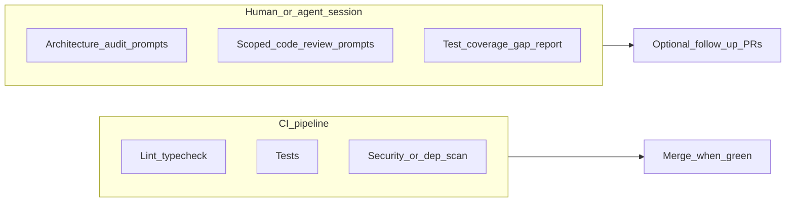

# Dev workflow: executing roadmap items

This document is for the developer (or coding agent) who picks up `Agentic-led` work,
implements it against contracts, and merges back.

For setup (install, pre-commit hook, IDE stubs) see [setup.md](setup.md).
For the PM authoring guide see [pm-workflow.md](pm-workflow.md).

---

## Your role in the system

| You own | You do not touch |
| --- | --- |
| Branch, implementation, tests, merge | Roadmap chunk authoring (PM territory) |
| Registry claim + deregistration | Human-led gate decisions |
| Pre-commit validation passing | `shared/` contracts (read only — flag gaps to PM) |

If you reach an `agentic` task whose `agentic_checklist` is incomplete or whose
`contract_citation` does not resolve to a real file — **stop**. Flag it to the PM.
A missing contract is a planning gap, not something to fill during implementation.

---

## The task loop

### Start: automated path

The automated path syncs the integration branch (defaults from **`roadmap/git-workflow.yaml`**, else `main`), **lists** eligible
agentic tasks (with **Blocked** and **Git-rejected MR** rows first when Git remote settings allow enrichment), you **choose one by number** at the prompt, then it creates the branch,
registers it, and writes the brief and prompt in one step.

With sync **on** (the default), your working tree must be **clean** — commit, stash, or
discard local changes first. The tool runs `git fetch`, checks out the integration
branch, and `git merge --ff-only` against the remote ref (e.g. `origin/main`). If your
local integration branch has diverged, resolve that before retrying. Use `--no-sync`
for offline use or CI. Set **`roadmap/git-workflow.yaml`** to your real trunk (e.g. `dev`) or pass **`--base dev`** once without editing the file.

**Terminal:**

```bash
specy-road do-next-available-task
# optional overrides: specy-road do-next-available-task --base dev --remote origin
# offline:  specy-road do-next-available-task --no-sync
```

**IDE slash command** (after `specyrd init --ai <ide> --role dev`):

```text
/specyrd-do-next-task
```

Open the generated `work/prompt-<NODE_ID>.md` in your agent. Implement, commit
incrementally.

### Start: manual path

Use the manual path when you want to pick a specific node rather than taking the next
available one, or when you need finer control over the registry entry.

1. Find a node in the generated `roadmap.md` at your **application** project root where `execution_milestone` is
   `Agentic-led` or `Mixed`, `status` is `Not Started`, and all `dependencies` are
   `Complete`. (Worked example in this repo: [`roadmap.md`](../tests/fixtures/specy_road_dogfood/roadmap.md) under the dogfood fixture.)
2. Confirm it is not claimed in `roadmap/registry.yaml`. (Example: [`registry.yaml`](../tests/fixtures/specy_road_dogfood/roadmap/registry.yaml) in the dogfood fixture.)
3. Branch and register:

**Terminal / IDE (`/specyrd-claim`):**

```bash
git checkout -b feature/rm-<codename>
# add entry to roadmap/registry.yaml, then:
specy-road validate
git add roadmap/registry.yaml
git commit -m "chore(rm-<codename>): register as in-progress"
```

That registration commit exists on the **feature branch** until merge. A PM who keeps the **integration branch** checked out will not see that row in **HEAD’s** `registry.yaml` until it lands on their branch **unless** they use the PM Gantt **remote registry overlay** (see [design-notes/registry-hydration-remote-refs.md](design-notes/registry-hydration-remote-refs.md))—see also [pm-workflow.md](pm-workflow.md#monitoring-in-progress-work-while-on-the-integration-branch) and [design-notes/pm-gantt-registry-checkout.md](design-notes/pm-gantt-registry-checkout.md).

4. Generate a brief:

**Terminal / IDE (`/specyrd-brief`):**

```bash
specy-road brief <NODE_ID> -o work/brief-<NODE_ID>.md
```

The brief lists **ancestor** planning feature sheets (parent phase/milestone) and **this node’s** sheet under `planning/`. Read ancestors first for scope and constraints, then the leaf sheet, then cited `shared/` contracts.

5. Implement, commit incrementally.

### Finish (both paths)

Run from the feature branch when implementation is complete.

**Terminal:**

```bash
specy-road finish-this-task
# optional: specy-road finish-this-task --push
#          specy-road finish-this-task --push --remote origin
```

**IDE slash command:**

```text
/specyrd-finish
```

This will:

1. Read the current branch name to find the codename and registry entry (the registry
   `branch` must match `HEAD`).
2. Update the node `status` to `Complete` in the roadmap chunk file (or use `specy-road finish-this-task`).
3. Remove the registry entry.
4. Run `specy-road validate` and `specy-road export`.
5. Commit the bookkeeping changes.
6. Unless `--push` was passed, print the `git push` + `gh pr create` commands to open a PR.
   With `--push`, run `git push -u` after the bookkeeping commit, then print the PR hint.

Merge when CI is green. No PM sign-off required.

---

## Branch model

One branch per roadmap milestone. All feature branches fork from and merge back to the
same integration branch.

```text
main ─────────────────────────────────────────────► main
  └─ feature/rm-auth-middleware ─────────────────┘
  └─ feature/rm-entry-api  ───────────────────┘
  └─ feature/rm-export-pipeline  ─────────────────────┘
```

Multiple parallel branches is the normal operating state. The registry makes active
claims visible so touch zone conflicts surface before file collisions.

**Naming:** `feature/rm-<codename>` where `<codename>` matches the roadmap node's
`codename` field exactly (kebab-case). The `rm-` prefix distinguishes roadmap-driven
branches from ad-hoc `fix/<slug>` or `feature/<slug>` branches.

Non-roadmap work (hotfixes, tooling) uses `fix/<slug>` without the `rm-` prefix and
does not touch `registry.yaml`.

---

## After merge: fix, refactor, or hardening

Merged work can still need correction (bugs), standards cleanup, or a maintainer-led
refactor. That is normal; it does not require rewriting history on a shared integration
branch.

**Non-roadmap cleanup (default):** Branch from current `main` (or your team’s integration
branch), use `fix/<slug>` or `feature/<slug>`. Do **not** add a `registry.yaml` entry
unless your team explicitly tracks this work on the roadmap.

**Roadmap-visible rework:** If stakeholders need the graph to show the effort (touch
zones, dependencies, ordering), the PM adds a **new** node (or follows your team’s
policy for reopening — see below). You then use `feature/rm-<codename>` with
first-commit registration per [git-workflow.md](git-workflow.md).

Git mechanics for “undoing” a merge on a shared branch are covered in
[git-workflow.md](git-workflow.md#correcting-merged-work-revert-vs-follow-up) (revert PR
vs follow-up branch — avoid `git reset --force` on shared history).

---

## Re-doing or re-opening a roadmap item

**Registry:** A `feature/rm-<codename>` branch is **one active claim per codename**.
After `finish-this-task` and merge, the registry entry is gone and the feature branch
is usually deleted. You cannot register the **same** codename again while the old branch
name is the workflow’s anchor — rework uses a **new** branch: typically `fix/...`, or
`feature/rm-<codename>` where the PM has assigned a **new** codename / node for the
follow-up.

**Status:** `specy-road finish-this-task` only moves status **to** `Complete`. Moving a
node back from `Complete` to `Not Started` or `In Progress` is a manual chunk edit by
the PM (or delegate), with team agreement — it affects audit trail and anything that
depended on that node being done. Prefer adding a **follow-up task** with a clear title
over silently rolling status backward, unless your team explicitly uses rollback.

---

## Senior or maintainer review

Code review, refactors, and hardening PRs are a normal **human** layer on top of
contracts and CI. They are **not** a substitute for green CI or a second “PM sign-off”
gate — see [pm-workflow.md](pm-workflow.md). A maintainer may open a `fix/` branch after
merge to bring code up to standards without a new roadmap node; that stays lightweight
and out of `registry.yaml` unless the PM tracks it.

---

## CI gates vs optional session review

**CI (or equivalent automation)** should run **deterministic** checks — same commands
every time — and block merge when that is team policy: lint, typecheck, tests, optional
dependency or security scans, etc. Document those commands in `docs/` (or your app
repo’s canonical place) so humans and agents run what CI runs.

**Optional agent or senior sessions** (architecture audits, scoped review prompts,
coverage-gap reports) are **judgment-heavy** and context-heavy. Use them **before** or
**after** merge as needed; they complement CI rather than replacing it. Do not assume
every repo will run LLM-style audits inside the pipeline — reserve CI for what can be
enforced mechanically.



---

## Optional: quality and compliance prompts

For **copy-paste prompts** (architecture compliance, scoped code review, test coverage
audit, dependency audit, security audit, pre-release checklist) that stay
project-agnostic — with placeholders for your lint/test/scan commands — see
[optional-agent-review-prompts.md](optional-agent-review-prompts.md). They are optional;
this kit’s core workflow remains `specy-road` commands and contracts.

---

## Reading the agentic checklist

Every `agentic` sub-task carries an `agentic_checklist`. The prompt file generated by
`do-next-available-task` includes these fields, but you can also read them directly in
the brief or roadmap chunk.

| Field | What it tells you |
| --- | --- |
| `artifact_action` | Exactly what to build or change |
| `contract_citation` | Which doc/section to conform to — **read it** |
| `interface_contract` | Inputs → outputs (API shape, file format, component props) |
| `constraints_note` | Security, performance, or UX rules that bind you |
| `dependency_note` | What must exist before you start |

Optional:

| Field | What it tells you |
| --- | --- |
| `success_signal` | Observable behavior or test confirming done |
| `forbidden_patterns` | Explicit prohibitions |

---

## Multi-agent coordination

When multiple developers or agents are running simultaneously:

- `do-next-available-task` filters out already-claimed nodes — safe to run in parallel.
- `specy-road validate` warns on overlapping touch zones between registry entries.
- **Prefer git worktrees** for parallel agents on one machine — isolated working trees
  on disjoint branches.
- **Milestone dependencies are hard stops** — In JSON, `dependencies` lists **`node_key` UUIDs**
  (stable references to other nodes), not display ids like `M1.1`. Semantically, if milestone A must
  finish before milestone B, A’s `node_key` appears in B’s `dependencies`; tools resolve those keys to
  display ids in UIs and briefs. The dependent node cannot proceed until every listed dependency is
  `Complete` (see `specy_road/bundled_scripts/do_next_task.py`).

---

## Quick reference

```bash
# Terminal
specy-road do-next-available-task   # sync base, list+choose, branch, register, brief + prompt
specy-road finish-this-task         # complete, validate, export, commit, PR hint (--push optional)
specy-road validate                 # validate merged roadmap graph + registry
specy-road brief <NODE_ID>          # manual: generate brief for a specific node
specy-road export                   # regenerate roadmap.md
```

```text
# IDE slash commands (after specyrd init --role dev)
/specyrd-do-next-task   — automated start
/specyrd-claim          — manual start: branch + register
/specyrd-brief          — manual start: generate brief
/specyrd-finish         — finish (both paths)
/specyrd-validate       — validate at any point
```
