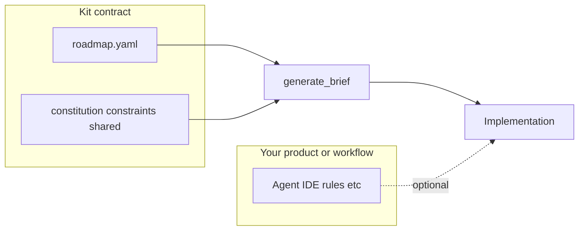

# Philosophy and scope

This document is for **humans and coding agents** adopting or working on specy-road. It states what the kit is **opinionated** about and what it **does not** prescribe.

## What specy-road is opinionated about

- **Roadmap-first evolution** — [`roadmap/roadmap.yaml`](../roadmap/roadmap.yaml) is the canonical graph: immutable milestone IDs, dependencies, gates, codenames, and touch zones.
- **Separation of concerns** — [`constitution/`](../constitution/) holds purpose and principles (human judgment). [`constraints/`](../constraints/) holds enforceable, checkable rules. Operational detail belongs in constraints and contracts, not in aspirational prose.
- **Contracts over tribal knowledge** — [`shared/`](../shared/) holds specs and policies that tasks **cite**; implementation work ties back to those files instead of duplicating intent in chat.
- **Multi-agent safety** — [`roadmap/registry.yaml`](../roadmap/registry.yaml) plus touch zones and first-commit registration ([`git-workflow.md`](git-workflow.md)) make parallel work visible before conflicts.
- **Adaptive depth** — Default to lightweight planning (node + contracts + notes in [`work/`](../work/)). Use optional [`specify/<node-id>/`](../specify/README.md) when risk or complexity demands structured spec → plan → tasks **as files in the repo**, not as a mandated agent ceremony.

## What specy-road does not prescribe

- **Which coding agent or IDE** you use (Cursor, Claude Code, Copilot, none, etc.).
- **How** an agent plans or implements inside a session (step lists, tool choice, prompts). That is between the user and their tools.
- **Product-specific stacks** — The roadmap describes *what* and *which contract*; stack choices belong in your application’s ADRs and contracts under `shared/` (or your app repo), not in the kit’s core rules.

Optional patterns for teams that *want* IDE rules, `CLAUDE.md`, MCP servers, or similar are collected in [`optional-ai-tooling-patterns.md`](optional-ai-tooling-patterns.md). Those patterns are **not** part of specy-road’s contract.

## Relationship to Spec-Kit

[Spec-Kit](https://github.com/github/spec-kit) is a useful reference for spec discipline and context hygiene. specy-road is **not** Spec-Kit; it emphasizes a **roadmap graph + registry** and leaves agent-side workflows flexible.

## Agent load order (keep context small)

Coding agents should read in this order (see also [`../AGENTS.md`](../AGENTS.md)):

1. [`constitution/purpose.md`](../constitution/purpose.md)
2. [`constitution/principles.md`](../constitution/principles.md)
3. [`constraints/README.md`](../constraints/README.md)
4. [`roadmap/roadmap.yaml`](../roadmap/roadmap.yaml) — **your node** plus parents and `dependencies` only
5. [`shared/README.md`](../shared/README.md) — then open **only** contract files cited for the task

For a focused slice:

```bash
python scripts/generate_brief.py <NODE_ID> -o work/brief-<NODE_ID>.md
```

## Flow (high level)



The kit supplies **roadmap.yaml**, constitution, constraints, and **shared** contracts. **Implementation** happens in your codebase; optional agent/IDE configuration is outside the kit’s required surface.
