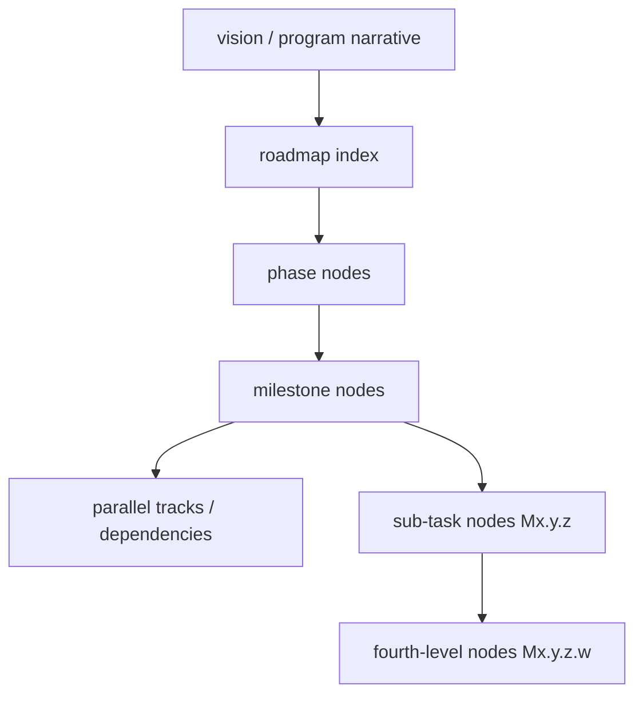

# Roadmap authoring: JSON manifest and chunk files

## Source of truth

**Canonical:** the roadmap graph under [`roadmap/`](../tests/fixtures/specy_road_dogfood/roadmap/). The entry file is **required**: [`roadmap/manifest.json`](../tests/fixtures/specy_road_dogfood/roadmap/manifest.json) with `version` and `includes` — an ordered list of **JSON** chunk paths relative to `roadmap/`. Each chunk file holds a `nodes` array (or a single-node shape accepted by the loader); see [JSON chunks](#json-chunks-json).

Display **`id`** values may be **renumbered** when outline operations rewrite the tree; stable identity is always **`node_key`** (UUID). Gaps in numbering are allowed; do not recycle or collide **`node_key`** values. (See [Display `id` vs stable `node_key`](#display-id-vs-stable-node_key) below.)

### PM vocabulary vs schema `type`

The schema uses small enums; this is how they usually map to product thinking:

| Schema `type` | Typical PM meaning |
|---------------|-------------------|
| `phase` | A major arc or release train (often spans multiple deliverables). |
| `milestone` | A shippable slice or **feature**-sized outcome (codename, touch zones, dependencies). |
| `task` | **Sub-feature** or implementation slice (often `execution_subtask`-tagged). |
| `vision` | Program-level narrative when you use that layer. |

Dependencies and `parallel_tracks` express what can run in parallel vs what must wait — not the `includes` order alone.

---

## Roadmap layers

The graph has a natural depth hierarchy. **Node definitions** live in chunk files under `roadmap/`; [`roadmap.md`](../tests/fixtures/specy_road_dogfood/roadmap.md) is a **generated index** for reading.



| Layer | Node `type` | Role |
|-------|-------------|------|
| **Vision** | `vision` | Why the project exists; principles and metrics. |
| **Phase** | `phase` | Time-bounded arc; execution milestone gate. |
| **Milestone** | `milestone` | Atomic delivery unit in the index status table; goal, acceptance, codename, touch zones. |
| **Parallel tracks / dependencies** | (node fields) | Concurrent vs. sequenced work — set `parallel_tracks` and `dependencies`. |
| **Sub-tasks** | `task` (depth 3) | Checklist granularity; tagged `execution_subtask`. **Immutable** IDs. |
| **Fourth-level** | `task` (depth 4) | Additive only; same immutability rules as sub-tasks. |

---

## JSON chunks (`.json`)

Keep the graph **logically split** across multiple files under `roadmap/` so each file stays small and **diff-friendly in git**.

### Manifest (`manifest.json`)

- **`version`** — integer (schema expects `1`).
- **`includes`** — ordered list of chunk paths relative to `roadmap/` (e.g. `phases/M0.json`, `phases/M1.json`).

Validated by [`schemas/manifest.schema.json`](../tests/fixtures/specy_road_dogfood/schemas/manifest.schema.json). Do not add a top-level `nodes` key to the manifest — nodes live only in chunk files.

**PM ordering:** `includes` order controls **merge order** when the loader concatenates chunk `nodes` arrays (and affects diffs and narrative flow in some tools). It does **not** define which actionable **leaf** `specy-road do-next-available-task` auto-picks among equally eligible work — that follows **outline (tree) order** (see [Reordering and reparenting](#reordering-and-reparenting)). **Gating** (what may start) is still driven by each node’s `dependencies` and `status`. The generated [`roadmap.md`](../tests/fixtures/specy_road_dogfood/roadmap.md) index uses its **own** sort on display `id` for reading; that sort is not the same as merge list order or auto-pick order.

### Chunk shape

Recommended on-disk shape (stable key order when tools save):

```json
{
  "nodes": [
    {
      "dependencies": [],
      "id": "M0",
      "parent_id": null,
      "status": "Complete",
      "title": "Foundation",
      "type": "phase"
    }
  ]
}
```

The loader also accepts a top-level JSON **array** of node objects, or a single object with an `id`. Validation uses [`schemas/roadmap.schema.json`](../tests/fixtures/specy_road_dogfood/schemas/roadmap.schema.json) on the **merged** graph.

Use the `notes` field (markdown string) for short context in the graph. **Vision, phase, milestone, and task** nodes must set **`planning_dir`** to a single feature sheet path: `planning/<id>_<slug>_<node_key>.md` — see [`planning/README.md`](../tests/fixtures/specy_road_dogfood/planning/README.md).

### Line-count policy (~500)

- **Manifest** [`manifest.json`](../tests/fixtures/specy_road_dogfood/roadmap/manifest.json): keep small; limit from `roadmap_manifest_max_lines` in config.
- **JSON chunks** under `roadmap/` (except `manifest.json`): may not exceed **`roadmap_json_chunk_max_lines`** (default **500**) unless the chunk contains **exactly one** node.

[`registry.yaml`](../tests/fixtures/specy_road_dogfood/roadmap/registry.yaml) is separate from the graph and is not a merge chunk.

Enforced by `specy-road validate` (via [`specy_road/bundled_scripts/roadmap_load.py`](../specy_road/bundled_scripts/roadmap_load.py)). Configure limits in [`constraints/file-limits.yaml`](../constraints/file-limits.yaml) in **your** project (or the toolkit’s [`constraints/file-limits.yaml`](../constraints/file-limits.yaml) when working on this repository).

### Automatic chunk routing (no daily commands)

Writes that add a node (`add-node`, PM Gantt add-task, `edit-node` when growth pushes a chunk over the cap) go through an **automatic chunk router**. PMs no longer pick a chunk or split full chunks. Routing (deterministic): hint chunk if it fits → smallest valid chunk in the same phase subtree (manifest-order tie-break) → smallest valid chunk anywhere → auto-create a new chunk named `<base-stem>__<6hex>.json` where `<6hex>` is the new node's `node_key` prefix (same key → same filename; different keys → different filenames, so concurrent PMs never collide on chunk files — only the manifest gets a trivially-mergeable add). All mutations run in an atomic plan that snapshots every affected file and rolls back on validation failure. `--chunk` on `add-node` is now optional (still accepted as a hint). Existing repos stay byte-identical until the next mutation triggers an auto-create. Power-user maintenance: `specy-road rebalance-chunks [--dry-run]` re-packs chunks deterministically (idempotent; not required for routine authoring).

---

## Reordering and reparenting

### Single source of truth: identity vs on-disk layout

| Question | Source of truth |
|----------|-----------------|
| Who is this node forever? | **`node_key`** (UUID) — never rename or recycle. |
| What must `dependencies` reference? | Other nodes’ **`node_key`** values (not display `id`). |
| What do humans and the CLI type for `brief`, registry, branch context? | Display **`id`** (`M…`) and [`registry.yaml`](../tests/fixtures/specy_road_dogfood/roadmap/registry.yaml) `node_id` — must match the node’s current **`id`**. |
| Where does “tree order” for siblings live? | **`parent_id`** + **`sibling_order`** (outline tools and renumbering use these; siblings sort by `(sibling_order, id)`). Prefer **unique consecutive `sibling_order`** per parent so tie-breaks do not depend on display `id` strings. |
| What encodes the planning file path? | **`planning_dir`** → `planning/<id>_<slug>_<node_key>.md` — the **display `id`** appears in the filename; when `id` changes, update `planning_dir` and rename the file (see below). |

**Disk layout:** Chunk file placement and `manifest.json` **`includes`** order only affect how the merged **`nodes` array** is built. They do **not** change `node_key` or dependency edges by themselves.

### Supported workflow

1. **Reparent or reorder** via the PM UI or `specy-road` CRUD by editing **`parent_id`** and **`sibling_order`**. Do **not** mint new `node_key` values or rewrite **`dependencies`** unless you are splitting/merging nodes or intentionally changing gates.
2. **Renumber display ids** when needed using outline renumber (e.g. full-tree rewrite from tree shape). Stable **`node_key`** and **`dependencies`** (UUID lists) stay the same; display **`id`** values update.
3. **Planning sheets:** After **`id`** or codename changes, ensure each node’s **`planning_dir`** matches the canonical pattern (see [`planning_filename_for_node`](../specy_road/bundled_scripts/planning_artifacts.py)). Outline operations in this kit call [`sync_planning_artifacts`](../specy_road/bundled_scripts/sync_planning_artifacts.py) to rewrite paths and rename files under `planning/`. You can also use `specy-road scaffold-planning` for new sheets. Manual edits should end with `specy-road validate`.
4. **Registry:** Active entries must use the current display **`id`** in **`node_id`**. If you renumber **`id`**, update open claims or `specy-road validate` will fail with an unknown `node_id`.
5. **Validate:** Run `specy-road validate` — it checks unique `id`/`node_key`, valid parents and dependency keys, DAG (no cycles), planning paths and filenames, and registry references.

### Chunk moves without changing the tree

Moving a node’s JSON from one chunk file to another or changing **`includes`** order **does not** change **`parent_id`**, **`sibling_order`**, **`node_key`**, or **`dependencies`**. Auto **do-next** order (outline-based) stays the same for the same eligibility snapshot.

### Example: renumber display id; logical “next” unchanged

Suppose milestone **A** has display id **`M4.1`**, stable **`node_key` K**, and **`dependencies`** satisfied by completed work. After an outline renumber, the same node might display as **`M8.1`** — **K**, **`dependencies`**, and **`sibling_order`** relative to its siblings are unchanged. The set of agentic, unclaimed, dependency-satisfied tasks is the same; `do-next-available-task` still picks using **outline order** among eligible nodes (after **Blocked** / MR-rejected priority). Renumbering alone does not shuffle that outline position unless **`parent_id`** or **`sibling_order`** also changed.

### Refactor and Git ergonomics

Prefer **one logical change per commit** (graph edit + `sync_planning_artifacts` + `registry.yaml` fixes if needed) so reviewers see intent. `specy-road validate` is the gate for orphan planning files and filename mismatches. Optional: CRUD and [`rename_planning_file_if_path_changed`](../specy_road/bundled_scripts/planning_rename.py) paths perform on-disk renames when updating nodes manually.

---

## Node fields reference

### Display `id` vs stable `node_key`

Every node carries **two** identifiers (see [`schemas/roadmap.schema.json`](../tests/fixtures/specy_road_dogfood/schemas/roadmap.schema.json)):

| | `node_key` | `id` |
|---|------------|------|
| **Role** | Stable UUID — never changes when the outline is reorganized. | Hierarchical **display** id (`M`, `M0.1`, …) used for the tree, `parent_id`, CLI `NODE_ID`, and [`roadmap/registry.yaml`](../tests/fixtures/specy_road_dogfood/roadmap/registry.yaml) `node_id`. |
| **Mutability** | Immutable for the lifetime of the node. | May be **renumbered** when running outline operations that rewrite display ids (dependencies stay keyed by `node_key`). |
| **Used in** | `dependencies` (each entry is another node’s `node_key`). | `parent_id`, human-facing commands (`specy-road brief M0.2`), exported tables. |

CLI and docs that say `NODE_ID` mean the display **`id`**, not `node_key`, unless a command explicitly accepts a UUID.

**Tooling:** Briefs and task pickers resolve `dependencies` to **display ids** for readability. Availability logic (`do-next-available-task`) uses **effective** prerequisites: each node’s explicit `dependencies` plus every `dependencies` entry on its **ancestors** (same union as the PM Gantt’s inherited dependency model). Each prerequisite is satisfied when that **`node_key`**’s node is `Complete`. Candidate selection is actionable **leaf-only**; ancestor/umbrella nodes are context containers and not default claim targets. **`type: gate`** nodes are never pickup targets. Among eligible leaves, auto-pick order follows **outline (tree) order**, not raw merged chunk order (see [Reordering and reparenting](#reordering-and-reparenting)).

### Required on every node

| Field | Description |
|-------|-------------|
| `node_key` | Stable UUID v4 (hex with hyphens). |
| `id` | Hierarchical display id, e.g. `M1.2` or `M1.2.3.4` (fourth-level supported). |
| `type` | `vision` / `phase` / `milestone` / `task` / `gate` |
| `title` | Human-readable label. |

### Required when `type` is `vision`, `phase`, `milestone`, `task`, or `gate`

| Field | Description |
|-------|-------------|
| `planning_dir` | Repo-relative path to one Markdown file, e.g. `planning/M1.1_my-milestone_<node_key>.md` — the feature sheet. Validated by `validate_roadmap.py`. See [`planning/README.md`](../tests/fixtures/specy_road_dogfood/planning/README.md). |

### Commonly used optional fields

| Field | When to use |
|-------|-------------|
| `codename` | Kebab-case unique label for branch naming (`feature/rm-<codename>`). Required if registering work. |
| `status` | `Not Started` / `In Progress` / `Complete` / `Blocked` |
| `execution_milestone` | Milestone-level gate: `Human-led` / `Agentic-led` / `Mixed` |
| `execution_subtask` | Sub-task tag: `human` / `agentic` / `human-gate` |
| `touch_zones` | Paths or areas this node modifies (enables overlap detection). |
| `dependencies` | **`node_key` UUIDs** of nodes that must reach `Complete` before this node starts (not display ids). |
| `parallel_tracks` | Integer — number of independent workstreams within this node. |
| `goal` | Concise statement of what the node achieves when complete. |
| `acceptance` | List of observable acceptance criteria. |
| `risks` | List of known risks or blockers to surface during planning. |
| `decision` | Architecture decision block (see below). |
| `notes` | Free-form prose; rendered in exported markdown Notes section. |
| `agentic_checklist` | **Required** when `execution_subtask: agentic`. See below. |

**Dropped status:** `Cancelled` is no longer a valid `status`. To retire a feature, remove the node (for example `specy-road archive-node <id> --hard-remove` after team agreement) or set an appropriate status such as **Complete** / **Blocked** with notes.

### Gate (`type: gate`)

A **Gate** is a **leaf-only** human hold point: it has a **planning sheet** (`planning_dir`) for PM notes (scaffolded with the **gate** template—why the hold exists, criteria to clear, decisions, resolution—not the full feature-sheet task outline), but it is **not** claimed via `do-next-available-task`, and **`roadmap/registry.yaml` must not** reference a Gate’s `node_id`.

- **Placement:** Parent must be **`vision` or `phase`** only (not `milestone` or `task`). A Gate cannot have child rows.
- **Scoped dev hold:** List the Gate’s **`node_key`** in `dependencies` on the **phase** (or an ancestor milestone) that covers the work you want to pause. Descendant agentic leaves **inherit** that prerequisite; until the Gate is **`Complete`**, those leaves are not actionable for automated pickup. Clear the hold by setting the Gate to **Complete** (or remove the Gate node if you must unwind the freeze — not preferred).

### Decision block (`decision`)

For milestones with a pending or resolved architectural fork:

```yaml
decision:
  status: pending        # or "decided"
  decided_date: "2026-04-10"   # ISO 8601; include when status is decided
  adr_ref: "docs/adr/ADR-001.md"  # path to the ADR
```

Rendered in exported phase markdown as `> Decision pending` or `> Decided (date) — ref`.

---

## Execution type tagging

Tag every sub-task so authors and agents know what needs a person vs. autonomous execution.

| Tag (`execution_subtask`) | Meaning |
|---------------------------|---------|
| `human` | Judgment, research, policy, sign-off — a person must do it. |
| `agentic` | Executable from specs without mid-task human input. |
| `human-gate` | **Blocking** decision — dependent `agentic` work must not start until resolved. |

Milestone-level (`execution_milestone`) reflects the dominant work type for the whole milestone: `Human-led`, `Agentic-led`, or `Mixed`.

### Rules for authoring sub-tasks

1. **Exactly one tag per sub-task** — or split the task.
2. **Split mixed work** — `human-gate` / `human` first, then `agentic` that depends on it.
3. **List `human-gate` before** dependent `agentic` items in the same milestone.
4. **Never bury a human decision inside an `agentic` node** — promote to `human-gate` (fourth-level ID or new sub-task).
5. **Architecture phase** is mostly `human`; later phases mostly `agentic` — deviations must be explicit.
6. **Every `agentic` node** must satisfy the agentic checklist completeness standard (see below).
7. **Stack-agnostic language** in roadmap tasks — see [Stack-agnostic task language](#stack-agnostic-task-language).

**Before (mixed — do not do this):** One task that combines a design choice ("document semantics") with implementation — agents stall or guess on the undecided part.

**After (separated — do this):** `human-gate` Decide overlap semantics and record decision → `agentic` Implement the rule per spec → `human` Acceptance review.

---

## Writing implementable `agentic` tasks

An agent can implement without clarifying questions; every ambiguous noun resolves to an entity, spec section, endpoint, or constraint.

### Five required elements (`agentic_checklist`)

| Field | Answers |
|-------|---------|
| `artifact_action` | What exactly is built or changed (named component, route, record). |
| `contract_citation` | Which doc, section, entity, or contract to conform to. |
| `interface_contract` | Inputs → outputs (API body, DB fields, component props, files). |
| `constraints_note` | Security, logging, performance, UX rules that bind the work. |
| `dependency_note` | Prior sub-task, stub, or merged milestone required first. **Reference by codename or display id** — do not paraphrase the prerequisite's intent here; `specy-road brief` inlines each effective dependency's `## Intent` under section 6. |

**Optional fields:**

| Field | Purpose |
|-------|---------|
| `success_signal` | Observable test or behavior confirming the task is done correctly. |
| `forbidden_patterns` | Patterns explicitly prohibited (e.g. "do not call live service — use stub"). |

**Contract traceability:** Each `agentic` task should map to at least one contract doc under `shared/`, `docs/`, `specs/`, or `adr/`. If it cannot, the contract write-up may be missing — flag before writing the task. Validation emits a warning when `contract_citation` does not reference a known path prefix. Use `contract_citation` in `agentic_checklist` (not alternate keys).

**Do not paraphrase upstream dependencies in this task's planning sheet.** `specy-road brief` carries `## 6. Dependency context (intent of upstream work)` with each effective dependency's `## Intent` block (or the gate equivalent) inlined verbatim. Restating that prose in `## Intent` or `## Approach` here just creates drift. Use `dependency_note` for *what must exist* (cited by codename or display id), and reserve your sheet's `## Intent` for **this** task's own outcome. Add a one-line clarification under `## Approach` only when something specific to *this* task is not covered by the dep's own intent (an integration seam, a contract version, a sequencing constraint), citing the dep by display id.

**Example (JSON node excerpt):**

```json
{
  "id": "M1.2.3",
  "parent_id": "M1.2",
  "type": "task",
  "title": "Auto-save for entry form",
  "execution_subtask": "agentic",
  "agentic_checklist": {
    "artifact_action": "Add PUT /entries/{id} partial-update handler per API contract entries section.",
    "contract_citation": "shared/api-contract.md — entries",
    "interface_contract": "Body: {field_name: value} dirty fields only. Response: {status, updated_at}. First save sets status In Progress.",
    "constraints_note": "Do not log field values server-side. Stubs only until staging permits live integration.",
    "dependency_note": "After M1.1 auth middleware; Entry table migrated.",
    "success_signal": "PUT returns 200 with updated_at; repeated save is idempotent.",
    "forbidden_patterns": "Do not call live external service in tests."
  }
}
```

---

## Stack-agnostic task language

Tasks state **what** and **to what contract** — not which framework, cloud SDK, or library. Stack choices live in ADRs and specs; the roadmap must not become a second source of truth.

| Avoid | Prefer |
|-------|--------|
| Framework or library names | "The API handler", "the migration", "the form component" |
| Vendor cloud service names | "Configured endpoint", "object storage", "async job queue" |
| SDK or tool names | "Token validated", "migration applied", "tests pass" |
| Identity-provider specifics in tasks | "Identity provider group claim", "SSO callback" |

**Safe to name:** entity and route names from published specs · behavioral requirements · compliance constraints · `docs/` references.

**Where stack detail belongs:** ADR (stack choice) · feature spec in `docs/` · `CLAUDE.md` or equivalent conventions file · **touch zones** (concrete paths once confirmed).

**Architecture-phase exception:** Decision blocks *may* name concrete options (e.g. framework A vs B) — that is the decision venue. After a decision lands in an ADR, later milestone tasks use functional roles, not product names.

---

## Spec crosswalk

Specs are produced before broad implementation and consumed in later milestones. Paths are typically under **`shared/`** or **`docs/`** in the repository.

| Spec type | Purpose | Consumed when |
|-----------|---------|---------------|
| **Feature spec** | Goal, UI/UX, fields, acceptance | Feature implementation |
| **Data model spec** | Entities, constraints, migrations | Any persistence work |
| **API contract spec** | Routes, schemas, auth, errors | Backend / frontend integration |
| **Prompt spec** | LLM I/O, templates, fallbacks | AI / LLM features |
| **Policy spec** | Rules, categories, audit requirements | Any compliance or moderation path |
| **RBAC matrix** | Roles × permissions × claims | Auth and access-control work |

If an `agentic` task cannot cite at least one of these, the spec may be missing — write or reference it before the task is marked ready.

---

## Multi-agent coordination

Multiple developers and multiple agents per developer are assumed.

### Before starting implementation

1. Confirm **gate** prerequisites (`dependencies`, `execution_milestone`) from the roadmap.
2. Check [`roadmap/registry.yaml`](../tests/fixtures/specy_road_dogfood/roadmap/registry.yaml) — avoid overlapping touch zones with in-progress work.
3. Branch from the integration branch: `feature/rm-<codename>` matching the milestone codename.
4. **First commit** registers the work in `registry.yaml` — same message as automation: `chore(rm-<codename>): register as in-progress` plus optional CI-skip suffix `[skip ci] [ci skip] ***NO_CI***` when using `do-next-available-task` or matching manually — no implementation before that commit.
5. Remove the registration entry **before** merging back.

### Parallelism rules

- **Independent** milestones may run in parallel only when touch zones and gates do not conflict.
- **Dependent** milestones (`dependencies` field) are not parallel without explicit sign-off.
- Registry overlap warnings (`specy-road validate`) surface potential conflicts before file collisions occur.

---

## PM editing workflow

1. Read [`vision.md`](../vision.md) for invariants before editing.
2. Edit the **JSON chunk** for the relevant phase; reorder **`includes`** in [`manifest.json`](../tests/fixtures/specy_road_dogfood/roadmap/manifest.json) when you want a different chunk merge order.
3. When editing chunks **by hand**, avoid arbitrary renumbering of display **`id`** values; gaps are allowed. Outline tools (e.g. PM UI) may still **rewrite display ids** for the whole tree; stable identity remains **`node_key`**.
4. Split oversized chunk files at ~500 lines, along milestone or theme boundaries; add new paths to the manifest.
5. Use `decision` blocks for architectural forks; link ADRs in `adr_ref` when they exist.
6. Tag sub-tasks; split mixed types; align milestone `execution_milestone` with the dominant work type.

---

## Generated index (`roadmap.md`)

- [`roadmap.md`](../tests/fixtures/specy_road_dogfood/roadmap.md) — **generated** index table with **Gate** column. Do not edit by hand.

Chunk files under [`roadmap/phases/`](../tests/fixtures/specy_road_dogfood/roadmap/phases/) are **source** (`.json` graph chunks).

Regenerate the index after editing chunks:

```bash
specy-road export
# or directly:
specy-road export
```

Check that the committed index matches the merged graph (e.g. in CI):

```bash
specy-road export --check
```

---

## Tooling

PMs may use **`specy-road` CRUD commands** (`list-nodes`, `show-node`, `add-node`, `edit-node`, `archive-node`) to change chunk files; see [PM workflow](pm-workflow.md#get-the-latest-roadmap-import--sync). The dashboard and `finish-this-task` update **JSON** chunks in place.

## Registry and brief

Active work registration stays in [`roadmap/registry.yaml`](../tests/fixtures/specy_road_dogfood/roadmap/registry.yaml). Bounded context for a single node:

```bash
specy-road brief <NODE_ID> -o work/brief-<NODE_ID>.md
```
