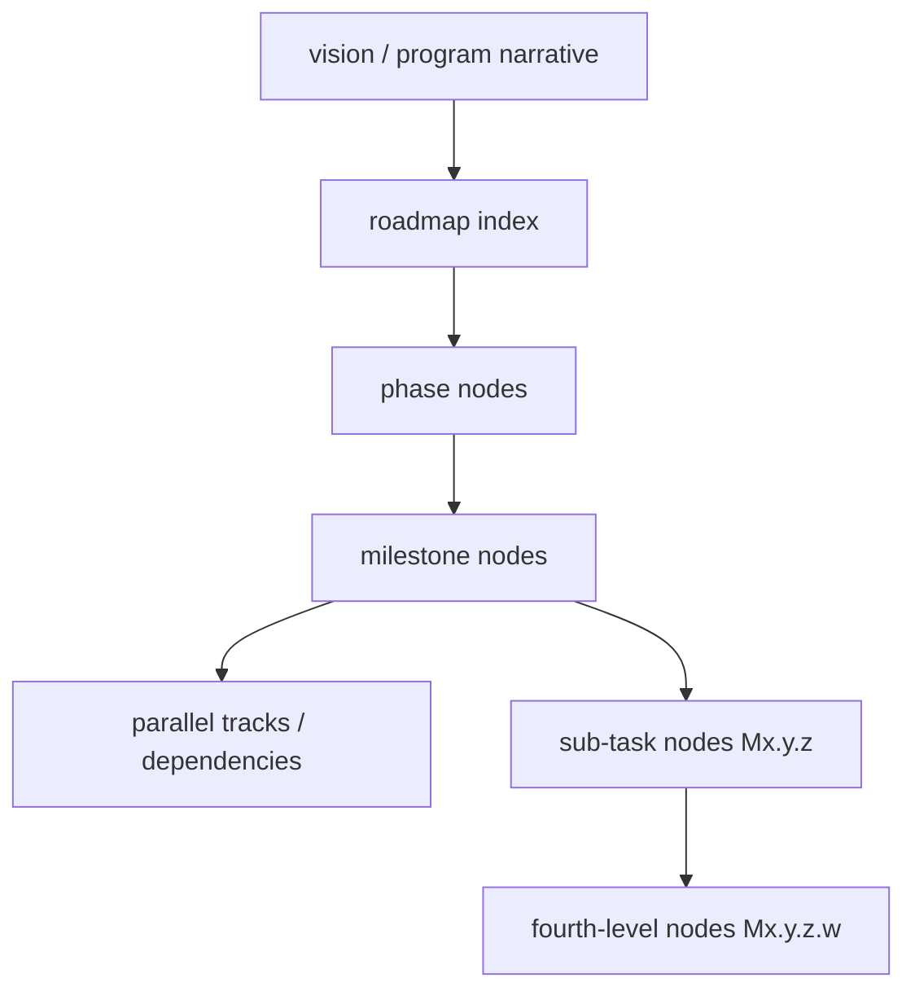

# Roadmap authoring: YAML and markdown views

## Source of truth

**Canonical:** the roadmap graph under [`roadmap/`](../roadmap/). The entry file is [`roadmap/roadmap.yaml`](../roadmap/roadmap.yaml): either the **full graph** (legacy) or a **manifest** that lists chunk files to merge in order.

All node IDs are **immutable**; gaps in numbering are allowed; **never renumber** existing IDs.

---

## Roadmap layers

The graph has a natural depth hierarchy. All layers live in YAML under `roadmap/`; the markdown files are generated views.



| Layer | YAML `type` | Role |
|-------|-------------|------|
| **Vision** | `vision` | Why the project exists; principles and metrics. |
| **Phase** | `phase` | Time-bounded arc; execution milestone gate. |
| **Milestone** | `milestone` | Atomic delivery unit in the index status table; goal, acceptance, codename, touch zones. |
| **Parallel tracks / dependencies** | (node fields) | Concurrent vs. sequenced work — set `parallel_tracks` and `dependencies`. |
| **Sub-tasks** | `task` (depth 3) | Checklist granularity; tagged `execution_subtask`. **Immutable** IDs. |
| **Fourth-level** | `task` (depth 4) | Additive only; same immutability rules as sub-tasks. |

---

## Hierarchical YAML (preferred)

Keep the graph **logically split** across multiple files under `roadmap/` so each file stays reviewable:

- **`roadmap.yaml`** — `version` and `includes` (paths relative to `roadmap/`), **without** a top-level `nodes` key.
- **Chunk files** (e.g. `phases/M0.yaml`) — each file is a mapping with a single `nodes` list for that slice of the tree (typically a phase subtree).

Order matters: nodes are concatenated from chunks in **include order**. Duplicate IDs across files are rejected by validation.

### Legacy single-file graph

If `roadmap.yaml` has **no** `includes` key, it may contain top-level `nodes` only. Do not use `includes` and `nodes` together.

### Line-count policy (~500)

No YAML file under `roadmap/` (except [`registry.yaml`](../roadmap/registry.yaml)) may exceed **500 lines**, **unless** that file's `nodes` array contains **exactly one** node — the smallest work-unit grain (e.g. one task with a large `agentic_checklist`).

Phase files commonly reach the mid-400s after milestone enrichment; splitting at a lower threshold creates unnecessary churn. **500 is the deliberate trigger for a split along milestone or theme boundaries.**

Enforced by `scripts/validate_roadmap.py` (via [`scripts/roadmap_load.py`](../scripts/roadmap_load.py)). The threshold is configurable via `roadmap_yaml_max_lines` in [`constraints/file-limits.yaml`](../constraints/file-limits.yaml).

---

## Node fields reference

### Required on every node

| Field | Description |
|-------|-------------|
| `id` | Immutable hierarchical ID, e.g. `M1.2` or `M1.2.3.4` (fourth-level supported). |
| `type` | `vision` / `phase` / `milestone` / `task` |
| `title` | Human-readable label. |

### Commonly used optional fields

| Field | When to use |
|-------|-------------|
| `codename` | Kebab-case unique label for branch naming (`feature/rm-<codename>`). Required if registering work. |
| `status` | `Not Started` / `In Progress` / `Complete` / `Blocked` / `Cancelled` |
| `execution_milestone` | Milestone-level gate: `Human-led` / `Agentic-led` / `Mixed` |
| `execution_subtask` | Sub-task tag: `human` / `agentic` / `human-gate` |
| `touch_zones` | Paths or areas this node modifies (enables overlap detection). |
| `dependencies` | IDs that must complete before this node starts. |
| `parallel_tracks` | Integer — number of independent workstreams within this node. |
| `goal` | Concise statement of what the node achieves when complete. |
| `acceptance` | List of observable acceptance criteria. |
| `risks` | List of known risks or blockers to surface during planning. |
| `decision` | Architecture decision block (see below). |
| `notes` | Free-form prose; rendered in exported markdown Notes section. |
| `agentic_checklist` | **Required** when `execution_subtask: agentic`. See below. |

### Decision block (`decision`)

For milestones with a pending or resolved architectural fork:

```yaml
decision:
  status: pending        # or "decided"
  decided_date: "2026-04-10"   # ISO 8601; include when status is decided
  adr_ref: "docs/adr/ADR-001.md"  # path to the ADR
```

Rendered in exported phase markdown as `> Decision pending` or `> Decided (date) — ref`.

---

## Execution type tagging

Tag every sub-task so authors and agents know what needs a person vs. autonomous execution.

| Tag (`execution_subtask`) | Meaning |
|---------------------------|---------|
| `human` | Judgment, research, policy, sign-off — a person must do it. |
| `agentic` | Executable from specs without mid-task human input. |
| `human-gate` | **Blocking** decision — dependent `agentic` work must not start until resolved. |

Milestone-level (`execution_milestone`) reflects the dominant work type for the whole milestone: `Human-led`, `Agentic-led`, or `Mixed`.

### Rules for authoring sub-tasks

1. **Exactly one tag per sub-task** — or split the task.
2. **Split mixed work** — `human-gate` / `human` first, then `agentic` that depends on it.
3. **List `human-gate` before** dependent `agentic` items in the same milestone.
4. **Never bury a human decision inside an `agentic` node** — promote to `human-gate` (fourth-level ID or new sub-task).
5. **Architecture phase** is mostly `human`; later phases mostly `agentic` — deviations must be explicit.
6. **Every `agentic` node** must satisfy the agentic checklist completeness standard (see below).
7. **Stack-agnostic language** in roadmap tasks — see [Stack-agnostic task language](#stack-agnostic-task-language).

**Before (mixed — do not do this):** One task that combines a design choice ("document semantics") with implementation — agents stall or guess on the undecided part.

**After (separated — do this):** `human-gate` Decide overlap semantics and record decision → `agentic` Implement the rule per spec → `human` Acceptance review.

---

## Writing implementable `agentic` tasks

An agent can implement without clarifying questions; every ambiguous noun resolves to an entity, spec section, endpoint, or constraint.

### Five required elements (`agentic_checklist`)

| Field | Answers |
|-------|---------|
| `artifact_action` | What exactly is built or changed (named component, route, record). |
| `spec_citation` | Which doc, section, entity, or contract to conform to. |
| `interface_contract` | Inputs → outputs (API body, DB fields, component props, files). |
| `constraints_note` | Security, logging, performance, UX rules that bind the work. |
| `dependency_note` | Prior sub-task, stub, or merged milestone required first. |

**Optional fields:**

| Field | Purpose |
|-------|---------|
| `success_signal` | Observable test or behavior confirming the task is done correctly. |
| `forbidden_patterns` | Patterns explicitly prohibited (e.g. "do not call live service — use stub"). |

**Spec traceability:** Each `agentic` task should map to at least one spec doc under `shared/`, `docs/`, `specs/`, or `adr/`. If it cannot, the spec may be missing — flag before writing the task. Validation emits a warning when `spec_citation` does not reference a known path prefix.

**Example:**

```yaml
- id: M1.2.3
  parent_id: M1.2
  type: task
  title: "Auto-save for entry form"
  execution_subtask: agentic
  agentic_checklist:
    artifact_action: >
      Add PUT /entries/{id} partial-update handler
      per API contract §entries.
    spec_citation: "shared/api-contract.md §entries"
    interface_contract: >
      Body: {field_name: value} dirty fields only.
      Response: {status, updated_at}.
      First save sets status In Progress.
    constraints_note: >
      Do not log field values server-side.
      Stubs only until staging permits live integration.
    dependency_note: "After M1.1 auth middleware; Entry table migrated."
    success_signal: "PUT returns 200 with updated_at; repeated save is idempotent."
    forbidden_patterns: "Do not call live external service in tests."
```

---

## Stack-agnostic task language

Tasks state **what** and **to what contract** — not which framework, cloud SDK, or library. Stack choices live in ADRs and specs; the roadmap must not become a second source of truth.

| Avoid | Prefer |
|-------|--------|
| Framework or library names | "The API handler", "the migration", "the form component" |
| Vendor cloud service names | "Configured endpoint", "object storage", "async job queue" |
| SDK or tool names | "Token validated", "migration applied", "tests pass" |
| Identity-provider specifics in tasks | "Identity provider group claim", "SSO callback" |

**Safe to name:** entity and route names from published specs · behavioral requirements · compliance constraints · `docs/` references.

**Where stack detail belongs:** ADR (stack choice) · feature spec in `docs/` · `CLAUDE.md` or equivalent conventions file · **touch zones** (concrete paths once confirmed).

**Architecture-phase exception:** Decision blocks *may* name concrete options (e.g. framework A vs B) — that is the decision venue. After a decision lands in an ADR, later milestone tasks use functional roles, not product names.

---

## Spec crosswalk

Specs are produced before broad implementation and consumed in later milestones. Paths are typically under **`shared/`** or **`docs/`** in the repository.

| Spec type | Purpose | Consumed when |
|-----------|---------|---------------|
| **Feature spec** | Goal, UI/UX, fields, acceptance | Feature implementation |
| **Data model spec** | Entities, constraints, migrations | Any persistence work |
| **API contract spec** | Routes, schemas, auth, errors | Backend / frontend integration |
| **Prompt spec** | LLM I/O, templates, fallbacks | AI / LLM features |
| **Policy spec** | Rules, categories, audit requirements | Any compliance or moderation path |
| **RBAC matrix** | Roles × permissions × claims | Auth and access-control work |

If an `agentic` task cannot cite at least one of these, the spec may be missing — write or reference it before the task is marked ready.

---

## Multi-agent coordination

Multiple developers and multiple agents per developer are assumed.

### Before starting implementation

1. Confirm **gate** prerequisites (`dependencies`, `execution_milestone`) from the roadmap.
2. Check [`roadmap/registry.yaml`](../roadmap/registry.yaml) — avoid overlapping touch zones with in-progress work.
3. Branch from the integration branch: `feature/rm-<codename>` matching the milestone codename.
4. **First commit** registers the work in `registry.yaml` (`chore(rm-<codename>): register as in-progress`) — no implementation before that commit.
5. Remove the registration entry **before** merging back.

### Parallelism rules

- **Independent** milestones may run in parallel only when touch zones and gates do not conflict.
- **Dependent** milestones (`dependencies` field) are not parallel without explicit sign-off.
- Registry overlap warnings (`specy-road validate`) surface potential conflicts before file collisions occur.

---

## PM editing workflow

1. Read [`vision.md`](../vision.md) for invariants before editing.
2. Edit the **chunk file** for the relevant phase; update status fields and `Last updated` in the index when scope or status changes.
3. **Never renumber** sub-task or fourth-level IDs — gaps are allowed.
4. Split oversized chunk files at ~500 lines, along milestone or theme boundaries; wire links from the manifest.
5. Use `decision` blocks for architectural forks; link ADRs in `adr_ref` when they exist.
6. Tag sub-tasks; split mixed types; align milestone `execution_milestone` with the dominant work type.

---

## Generated markdown (do not edit by hand)

- [`roadmap.md`](../roadmap.md) — index table with **Gate** column.
- [`roadmap/phases/`](../roadmap/phases/) — one file per top-level phase, listing the subtree. Includes **Notes**, **Details** (goal, acceptance, decision) when present.

Regenerate after editing YAML:

```bash
specy-road export
# or directly:
python scripts/export_roadmap_md.py
```

Check that committed markdown matches the graph (e.g. in CI):

```bash
python scripts/export_roadmap_md.py --check
```

---

## Markdown → YAML

There is **no** automatic importer. Edits to the graph happen in YAML under `roadmap/`. Markdown exists for readability and review.

PMs may use **`specy-road` CRUD commands** (`list-nodes`, `show-node`, `add-node`, `edit-node`, `archive-node`) to change chunk files; see [PM workflow](pm-workflow.md#get-the-latest-roadmap-import--sync). The on-disk YAML graph remains the source of truth.

## Registry and brief

Active work registration stays in [`roadmap/registry.yaml`](../roadmap/registry.yaml). Bounded context for a single node:

```bash
specy-road brief <NODE_ID> -o work/brief-<NODE_ID>.md
```
