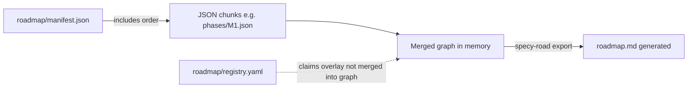

# Prompt: Build specy-road roadmap, registry, and planning from existing project notes

Copy everything below the line into your agentic coding tool. Replace `[REPO_ROOT]` with your repository root if you use absolute paths.

---

You are migrating **roadmap-like** information from an existing project into **specy-road’s** strict layout: a **merged JSON graph** under `roadmap/`, a **registry** for active claims, and **planning** Markdown per phase/milestone.

## Authoritative references

1. **`specy-road init project --dry-run`** — Lists every scaffold path; use as checklist.
2. **`docs/roadmap-authoring.md`** — Manifest, chunks, immutability, line limits, planning folders.
3. **`docs/git-workflow.md`** — Branch `feature/rm-<codename>`, first-commit registration, touch zones.
4. **JSON Schema** (consumer copy under `schemas/`): `roadmap.schema.json`, `manifest.schema.json`, `registry.schema.json`.

## Mental model (do not confuse these)



- **`roadmap/manifest.json`** — `version: 1` and `includes`: ordered list of chunk paths **relative to `roadmap/`**. Do **not** put `nodes` in the manifest.
- **Chunk files** — JSON containing a `nodes` array (or shapes the loader accepts per `docs/roadmap-authoring.md`). Split large graphs across multiple chunks for git-friendly diffs; respect line limits in `constraints/file-limits.yaml`.
- **`roadmap/registry.yaml`** — `version: 1`, `entries: []` or active rows. **Not** part of `includes`. Records in-progress work (codename, `node_id`, branch, `touch_zones`, optional `started`, `owner`, optional `node_key`).
- **`roadmap.md` at repo root** — **Generated** by `specy-road export`. Do not maintain it by hand as the source of truth.

## Phase 1 — Discovery

Find and consolidate:

- `ROADMAP.md`, epics, release plans, Notion exports, issue milestones, strategy docs.
- Dependencies between initiatives (order, blockers).
- **Touch zones** — repo path prefixes each initiative may change (for milestones and registry).
- **Codenames** for milestones if already named (must match kebab-case pattern used in git workflow: align with `codename` on milestone nodes and `feature/rm-<codename>` branches).

## Phase 2 — Graph rules (must satisfy validator)

After merge, every node must conform to `schemas/roadmap.schema.json` (validated on the **merged** graph).

### Required on each node

- **`id`** — Display id, pattern `M[0-9]+(\.[0-9]+)*` (e.g. `M1`, `M1.2`). **Immutable**; never renumber existing ids (gaps allowed).
- **`node_key`** — Stable **UUID** (lowercase hex with hyphens). Used in **`dependencies`** and optionally in registry.
- **`type`** — One of: `vision`, `phase`, `milestone`, `task`.
- **`title`** — Non-empty string.

### Dependencies

- **`dependencies`** — Array of **`node_key`** UUID strings (depends-on), **not** display `id` strings.

### Phase and milestone nodes

- Set **`planning_dir`** — Repo-relative directory (e.g. `planning/M1`). **Required** for `phase` and `milestone` nodes per validation/narrative rules.
- Under that directory, provide at least **`overview.md`** and **`plan.md`** (required). Optional: **`tasks.md`**, **`tasks/`** subtasks—see `planning/README.md` in the scaffold.

### Common optional fields

- `parent_id`, `sibling_order`, `status`, `notes`, `codename`, `touch_zones`, `parallel_tracks`, `execution_milestone`, `execution_subtask`, `goal`, `acceptance`, `risks`, `decision`, `agentic_checklist`.
- If **`execution_subtask`** is `"agentic"`, **`agentic_checklist`** must include all required keys: `artifact_action`, `contract_citation`, `interface_contract`, `constraints_note`, `dependency_note` (plus optional `success_signal`, `forbidden_patterns` per schema).

### Root `vision.md` vs graph

- **`vision.md`** at repo root is separate Markdown. A roadmap **`type: "vision"`** node is optional and is **not** the same artifact—see `docs/roadmap-authoring.md` vocabulary.

## Phase 3 — Registry

- Start from **`roadmap/registry.yaml`** with `version: 1` and `entries: []` unless migrating active work.
- Each active entry: **`codename`**, **`node_id`**, **`branch`** (`feature/rm-<codename>`), **`touch_zones`** (non-empty array), optional **`node_key`**, **`started`**, **`owner`** — see `schemas/registry.schema.json` and `docs/git-workflow.md` (first commit on a roadmap branch registers work; remove entry before merge).

## Phase 4 — Planning folders

For every `planning_dir` you reference:

1. Create `planning/<node-id>/overview.md` and `plan.md` with content derived from existing docs.
2. Use **`specy-road scaffold-planning <NODE_ID>`** when extending or creating folders from templates (if CLI available).

## Phase 5 — Export and limits

- Run **`specy-road export`** / **`specy-road export --check`** so **`roadmap.md`** is generated and consistent.
- Keep **`manifest.json`** small; keep each chunk under line limits unless a single-node exception applies per `docs/roadmap-authoring.md` and `constraints/file-limits.yaml` (`roadmap_manifest_max_lines`, `roadmap_json_chunk_max_lines`).

## Phase 6 — Verification

From `[REPO_ROOT]`:

```bash
specy-road validate
specy-road export --check
specy-road file-limits
```

Resolve all errors before finishing. Prefer splitting oversized JSON chunks or adjusting `file-limits.yaml` only when consistent with team policy.

## Non-goals

- Inventing a YAML “merged roadmap” file as the graph source.
- Storing active claims only in chat—use `registry.yaml` for in-progress registration per `docs/git-workflow.md`.
